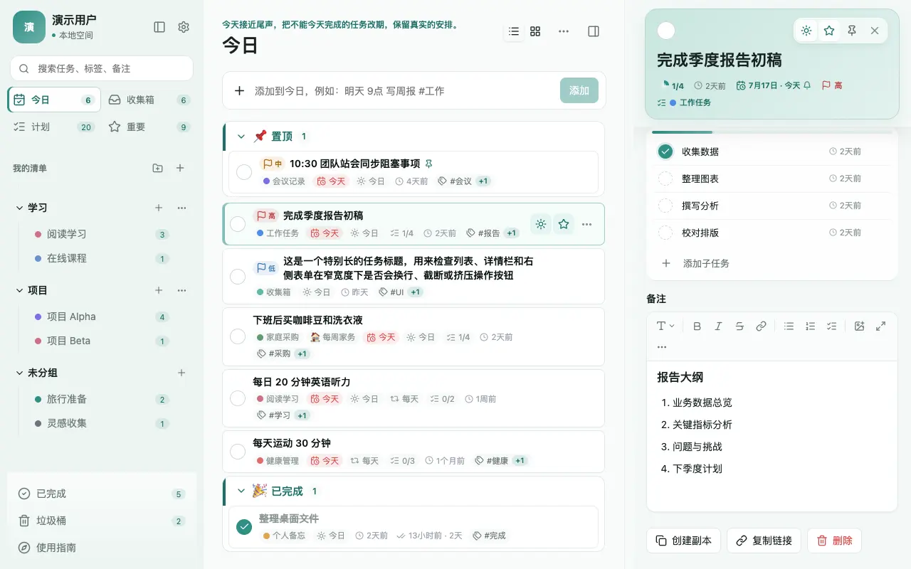
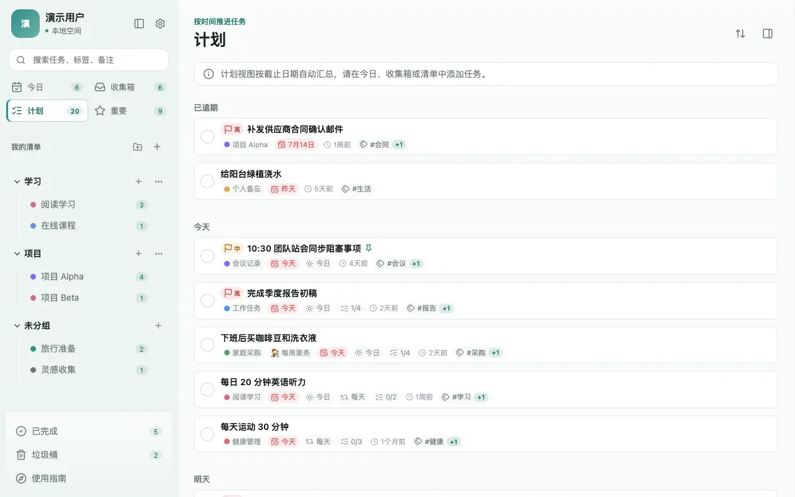
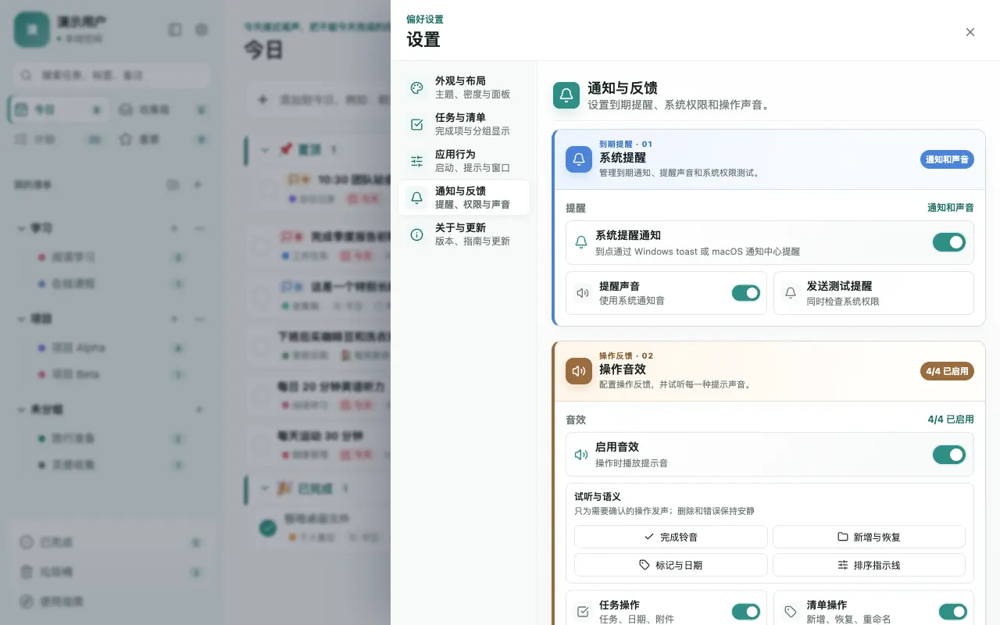
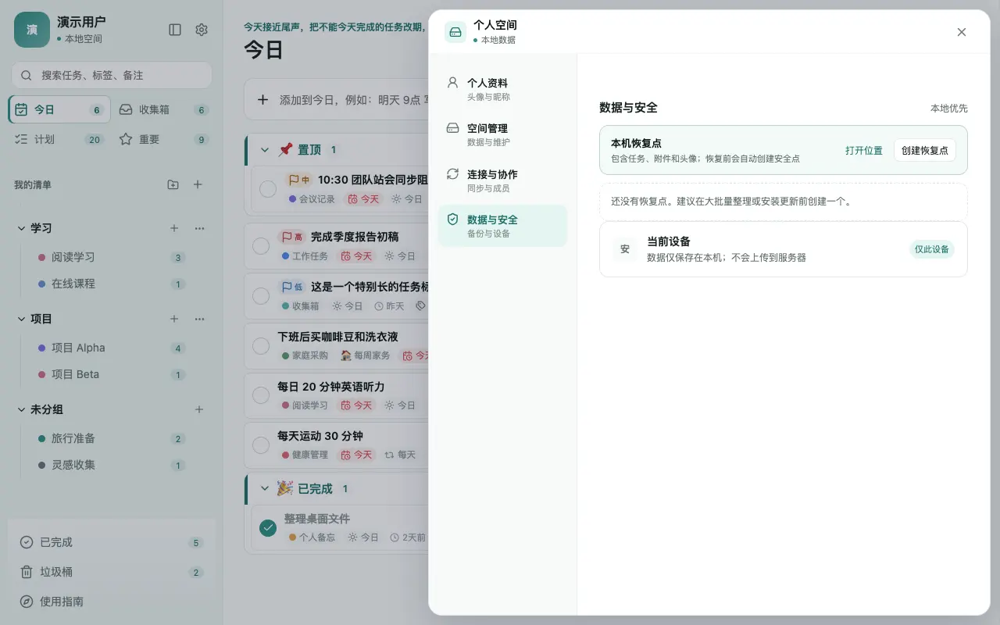

# 易简清单 · Simple To Do

> 本地优先的跨平台桌面待办应用。把复杂事情拆清楚，在变化中持续推进，直到做成。

[](https://v2.tauri.app/)
[](https://vuejs.org/)
[](https://www.sqlite.org/)

**易简清单**（Simple To Do）是一款面向 Windows 与 macOS 的个人任务管理软件。它不是把任务越堆越多的“功能集合”，而是帮助你把一件复杂事项拆成明确的下一步：收集、安排、完成、复盘，再继续推进。

[下载最新版本](https://github.com/DFreeMind/simple-to-do/releases/latest) · [查看功能](#核心功能) · [开发文档](#开发)


## 为什么是易简清单

- **本地优先**：任务、设置和附件默认只保存在本机 SQLite 数据库，不要求账号，也不依赖云端。
- **复杂事项可拆可追**：子任务、任务分组、日期、提醒、优先级、标签和富文本备注围绕“下一步是什么”组织。
- **真正的桌面体验**：基于 Tauri 2，提供 Windows 与 macOS 原生窗口、通知、托盘 / Dock 恢复和本地文件选择。
- **克制但完整**：不加入账号、同步、协作、番茄钟、习惯或完整日历等当前不服务于个人任务闭环的功能。

## 核心功能

| 让事情落地 | 让进度可见 | 让信息留在本机 |
| --- | --- | --- |
| 收集箱、今日、计划、重要、已完成、垃圾桶与全局搜索 | 子任务进度、任务分组、拖拽排序、重复任务、提醒与逾期重排 | SQLite 持久化、分层附件存储、恢复点、清理站与本地头像 |

- **快速记录与安排**：快速添加能识别日期、时间、重复规则、优先级和 `#标签`；任务可加入今日或计划到具体时间。
- **按场景查看任务**：今日、收集箱、计划、重要、已完成、垃圾桶、清单和搜索视图；支持智能排序和自定义顺序。
- **把大事拆开推进**：任务可配置子任务、进度、任务分组、优先级、标签、截止日期、提醒和重复规则。
- **写清楚而不只记标题**：富文本备注支持标题、列表、待办块、引用、链接与图片附件；图片可直接预览。
- **安心整理**：删除先进入垃圾桶；附件有清理站；大批量操作前可创建本机恢复点。
- **跨平台细节**：Windows 系统通知与托盘恢复、macOS 通知中心与 Dock / 菜单栏恢复；操作音效基于 Web Audio 合成，不依赖外部音频文件。

## 从收集到完成，一屏看清

### 把复杂任务拆成能开始的下一步

<p align="center">
  
</p>

任务详情将子任务进度、日期与提醒、优先级、任务清单、标签和富文本备注放在同一处；完成一个子任务，整体进度会随之更新。

### 用计划视图重新安排时间

<p align="center">
  
</p>

计划会按已逾期、今天和后续日期整理任务。重复任务、提醒、标签和子任务进度无需打开详情即可确认，让你能先处理最需要推进的事。

### 通知有提醒，数据也留有退路

<p align="center">
  
  
</p>

可以分别控制系统通知、提醒时机和操作音效；数据默认仅保存在本机，并能创建恢复点，在误操作后恢复到可信状态。

## 快捷键

| 操作 | Windows | macOS |
| --- | --- | --- |
| 打开搜索 | `Ctrl + K` | `⌘ + K` |
| 快速添加任务 | `N` | `N` |
| 将选中任务加入今日 | `D` | `D` |
| 关闭当前弹窗或面板 | `Esc` | `Esc` |
| 富文本加粗 / 斜体 | `Ctrl + B` / `Ctrl + I` | `⌘ + B` / `⌘ + I` |

快捷键仅在应用窗口处于前台时生效；输入框、富文本编辑器和弹窗会优先接收自己的按键，避免误操作。

## 下载与安装

请前往 [GitHub Releases](https://github.com/DFreeMind/simple-to-do/releases/latest) 下载对应系统的安装包：

- Windows：`simple-to-do_<version>_x64-setup.exe`
- macOS Intel：`simple-to-do_<version>_x64.dmg`

当前 Release 已提供 Windows x64 与 macOS Intel 版本；其他架构的可用情况请以 Release 页面资产列表为准。

应用是本地优先软件：安装、更新或卸载前如需保留数据，建议先在“个人空间 → 数据与安全”创建恢复点。

## 技术栈

- **桌面运行时**：[Tauri 2](https://v2.tauri.app/) + Rust
- **前端**：Vue 3、Pinia、Vite、SCSS
- **富文本**：[Tiptap](https://tiptap.dev/)
- **本地数据**：SQLite；图片附件按内容 hash 分层保存

## 开发

### 环境要求

- Node.js 20+
- npm 10+
- Rust stable toolchain
- Windows 构建需要 WebView2 与 Visual Studio Build Tools / MSVC
- macOS 构建需要 Xcode Command Line Tools

### 本地运行

```bash
npm install
npm run dev
```

`npm run dev` 会启动 Vite 并打开 Tauri 桌面窗口；浏览器页面不是产品运行入口。

### 构建与验证

```bash
# 仅构建前端
npm run frontend:build

# 构建当前平台的桌面安装包
npm run build

# Windows：构建带更新签名的安装包
npm run build:windows
```

构建后的分发文件位于 `src-tauri/target/release/bundle/`。只分发 Release 安装包，不分发 `target/` 下的中间编译产物。

## 产品边界

易简清单当前聚焦**本地个人任务管理与复杂事项推进**。以下能力暂不纳入：账号登录、云同步、多人协作、共享清单、外部日历同步、习惯、番茄钟和四象限。

## 文档

- [文档中心](docs/README.md)
- [安装与使用](docs/安装与使用.md)
- [产品需求文档](docs/产品需求文档.md)
- [产品调研](docs/产品调研.md)
- [功能路线图](docs/功能路线图.md)
- [界面设计规范](docs/界面设计规范.md)
- [技术架构](docs/技术架构.md)
- [数据模型](docs/数据模型.md)
- [开发规范](AGENTS.md)

## 许可证与品牌

本项目代码采用 [MIT License](LICENSE)。你可以在保留版权与许可证声明的前提下使用、修改和分发代码。

MIT 许可只授予软件著作权许可；“易简清单 / Simple To Do”名称、应用图标及其他品牌标识不因此获得商标或品牌使用许可。

## 反馈

欢迎通过 [Issues](https://github.com/DFreeMind/simple-to-do/issues) 提交问题、使用场景或改进建议。请尽量说明系统版本、应用版本和复现步骤；涉及本地数据时请先移除个人隐私信息。
