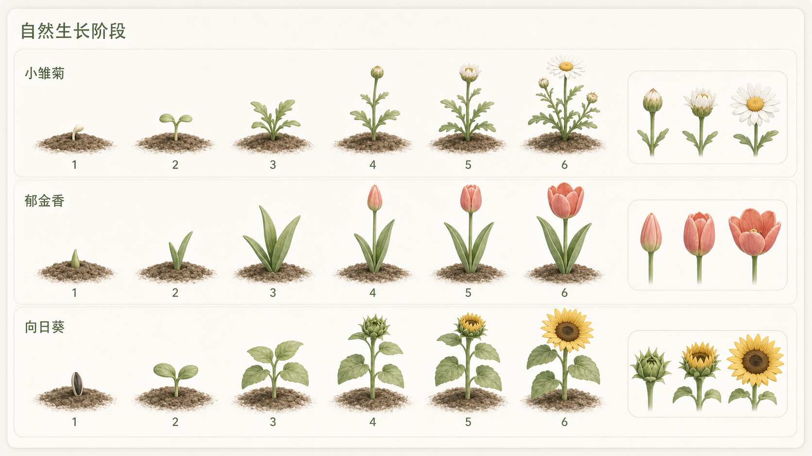
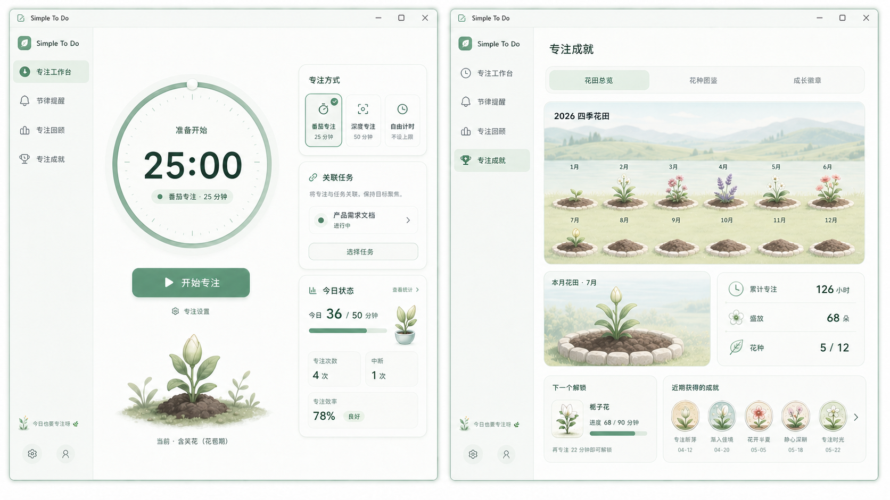
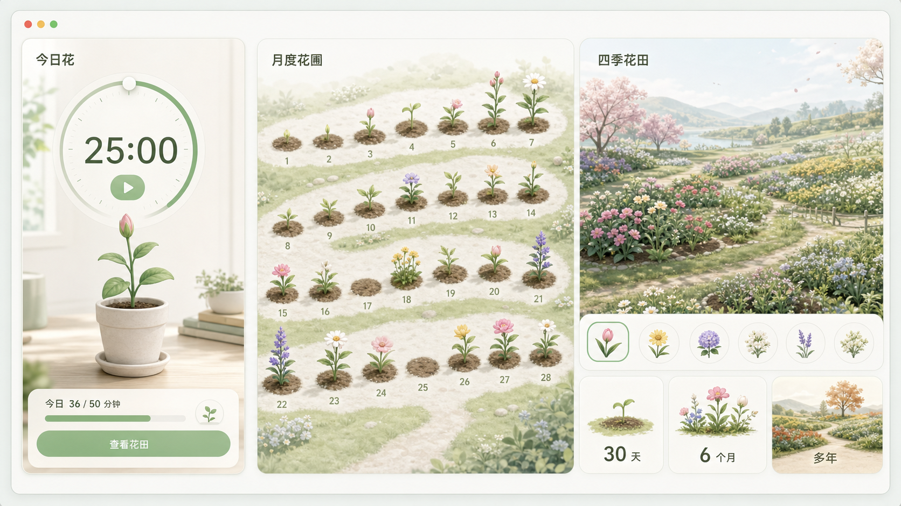

# 产品需求文档

## 产品定位

易简清单（Simple To Do）是一个**本地优先的个人复杂事项推进工具**。它不只是记录“还有什么要做”，而是帮助用户把一件事情拆清楚、安排到合适的时间，并在变化后快速找到下一步。

产品面向 Windows 与 macOS 桌面使用场景。当前不要求账号，数据默认只保存在本机；功能取舍优先服务于个人的任务闭环，而不是扩展为协作或全能效率平台。

## 目标与原则

- **先落地，再整理**：临时想法先进入收集箱；整理动作可以稍后完成。
- **今天只看今天**：今日视图聚焦已加入今日或今天到期的未完成任务，并允许从建议中加入。
- **复杂事情必须可拆**：子任务、任务分组、截止日期、提醒、优先级、标签和备注都服务于明确下一步。
- **本地数据可控**：不以登录换取使用权；删除、附件清理和恢复都提供可理解的回退路径。
- **克制而真实**：每个展示的入口必须可用；未上线能力不伪装成可点击功能。

## 当前能力

### 任务与组织

- 收集箱、今日、计划、重要、已完成、垃圾桶、清单和搜索视图。
- 收集箱优先承接未整理事项：对未安排的任务直接提供“加入今日”“明天”“整理”三种下一步，避免收集箱变成长期堆积区。
- 今日以“今日计划”“今天到期”和可一键加入的建议任务组织，不把所有未完成任务混入当天工作台。
- 计划默认以周为单位浏览和前后切换，按天承接已安排任务；逾期及周外任务仍保留在同一视图中，避免被周看板隐藏。
- 已完成以跨清单的完成记录工作台呈现：按完成时间分组，提供今天与本周统计、关键词、清单和时间范围筛选；任务仍可直接查看详情或恢复为未完成。
- 任务创建、编辑、完成、置顶、重要、复制、移动、删除、恢复和永久删除。
- 截止日期、任务提醒、重复规则、优先级、标签、子任务与子任务进度。
- 专注记录可关联任务；任务详情只汇总已完成且关联的专注投入，并可进入专注回顾查看完整记录。未关联专注明确保留为待归类数据，不计入任何任务。
- 清单分组与排序；清单内可切换列表/任务分组视图，支持跨分组拖拽。
- 快速添加识别常用日期、时间、重复规则、优先级和 `#标签`。
- 富文本备注与图片附件；支持链接、列表、待办块、引用、分割线和独立放大编辑。

### 计划与反馈

- 计划按逾期、今天、明天、本周和以后组织任务；逾期任务可以直接安排到今天、明天或取消日期。
- 系统提醒可按任务设置并支持测试通知；应用运行、重启或系统恢复后会处理尚未投递的到期提醒。
- 启动提示结合本地时段、星期、今日负荷和逾期状态生成；文案只在本机选择，不上传任务数据。
- 操作音效按任务、清单、分组和拖拽分类开关；仅用于有结果的操作反馈。

### 本机空间管理

- “个人空间 → 数据与维护 → 空间管理”按需读取本机应用数据，展示应用总占用及任务数据、已用图片/文件、待处理附件、清理站、头像、恢复点等分类大小；分类采用互斥口径，避免将附件总量和未引用附件重复相加。
- 扫描只识别未被任务、备注或回收站引用的附件，不自动删除。待处理附件先移入可恢复的清理站；永久删除必须二次确认。扫描同时提示失效引用，但不修改原任务数据。

### 应用模块

- 应用通过紧凑的全局模块栏区分“清单”和“时钟”；头像与设置属于全局入口，清单侧栏和时钟侧栏均可折叠。折叠后，全局模块栏继续显示当前模块的关键入口：清单保留常用视图，时钟保留专注工作台、节律提醒、专注回顾和专注成就，并明确标识当前所在页面。
- 时钟用于维持任务推进时的专注与日常节律，不承担习惯、健康诊断、考勤或完整日历的职责。它包含相互独立的“专注计时”和“节律提醒”：前者由用户主动开始，后者按个人设定在合适时机提示。

### 时钟：产品范围（首个完整版本）

时钟是可独立日用的“专注与节律”产品，而不只是任务模块中的倒计时。完整产品按以下七个体验面交付；研发可按依赖拆分，但任何已上线版本都不应把尚未实现的入口展示为可用。

#### 1. 专注工作台

- 提供番茄、深度专注、自由时长三种模式；番茄默认 25/5、每完成 4 轮专注后长休息 15 分钟，主工作台用简洁的环形倒计时呈现剩余时长。“轮次”指当前长休息周期内已完成的专注次数，可在设置的“专注与休息”中调整长休息前的轮数、短/长休息时长和自动开始休息。自由时长默认 25 分钟，可直接点击计时数字，为本次专注设定 1–480 分钟倒计时；倒计时运行中可增减 5 分钟；悬停计时器可查看开始和预计结束时间，所有时长、轮数、自动开始和提示音均可保存为个人预设。
- 支持开始、暂停、继续、提前结束、跳过休息、重启当前阶段；运行中可从主倒计时直接打开桌面专注控制器。控制器显示实时倒计时或自由计时，提供暂停/继续、增减 5 分钟、完成本轮和独立置顶开关，可拖动并在本次会话结束后自动关闭。
- 桌面专注控制器提供三种共享同一会话与操作能力的形态：默认推荐的“轨道表盘”、适合长期置顶的“专注岛”和兼容原有布局的“经典卡片”。新安装默认轨道表盘；旧版本升级后继续使用经典卡片，用户主动切换后记住选择。轨道表盘突出圆形进度，专注岛分为安静态和用户主动展开的操作态；暂停、休息和自由计时只改变颜色、文案与时间格式，不改变窗口形状。
- 三种形态只用于用户主动打开的持续专注控制器。专注完成、休息完成、节律到点、多提醒排队、错误和长说明继续使用经典矩形提醒窗，不能因追求外形压缩必要信息或操作。
- 开始前在同一张“本次计划”卡中完成专注方式和任务关联：可选择一个未完成任务、从最近任务快速继续，或直接开始无任务专注；任务选择器默认给出不超过 6 项的“建议专注”（最近专注、已逾期/今日到期、置顶或重要任务优先），任务以单列显示完整标题、所属清单、日期和优先级；分组模式按清单或任务分组显示为可展开卡片，清单树仅用于缩小范围；运行中将本次计划收束为当前节奏与关联任务摘要，可更换或解除任务关联，但绝不自动完成任务。
- 每次结束可选择“完成”“放弃”“被中断”并写入可选的一句备注，使回顾能够区分计划与实际，而非只累加时长。
- 专注进行中，当前任务完整标题、所属清单与直接更换入口放在右侧“本次计划”卡，主计时舞台保留完整的今日花展示；番茄模式同时显示当前轮次以及本轮结束后的休息安排。完成本轮是明确操作，提前结束作为独立弱操作并要求二次确认，避免误触丢失本轮记录。
- 今日状态以有效专注时长、完成轮次和距今日目标的剩余量为主；休息中或等待休息时，主舞台优先说明剩余休息时间与下一轮将回到的任务，帮助用户真正离开当前工作后再顺畅恢复。
- 完成一轮专注会推动“今日花”生长，并在完成庆祝层中展示本轮增加的成长和新阶段。当前版本已经产生的蓝莓、草莓、番茄、西瓜、南瓜继续作为“历史收获”保留和展示，不改写旧记录；新版本不再按单轮时长新增一套与花园并行的果实奖励，避免两套收集体系争夺注意力。
- 专注或休息到时后按窗口状态分层反馈：主窗口正在前台时只显示应用内完成弹层；窗口失焦、最小化或隐藏到后台时发送操作系统通知，回到应用后仍保留本轮结果。后台截止调度由 Rust 负责，不依赖 WebView 定时器持续运行；应用被明确退出后不承诺继续提醒。
- 操作系统关闭应用通知时，测试提醒必须明确提示权限问题并提供直达系统通知设置的入口，不能把“提交调用”误报为“通知已展示”。

##### 今日花：当前专注反馈

成长体系的目的不是奖励“打开应用”或制造连续打卡压力，而是把抽象的专注分钟变成可见、可回看的生命变化。专注工作台只承担前两层，后两层全部进入独立的“专注成就”模块：

1. **本轮成长**：每次完成的专注按实际有效分钟增加成长值，立即反馈“这次让花长了多少”，属于专注工作台。
2. **今日花**：一天只培养一株当前选择的花，围绕个人今日目标经历种子、破土、舒叶、花苞、初绽、盛放六个状态，属于专注工作台。
3. **长期花园**：每天结束时保存今日花的最终状态，未盛放的花也会被如实留下，属于专注成就。
4. **徽章**：只记录第一次盛放、累计盛放、累计专注或培养多个花种等里程碑，属于专注成就。

###### 今日生长规则

- 首次启用时推荐今日目标 **50 分钟**，同时提供 25、50、90 分钟和 10–240 分钟自定义目标。目标只影响花的开放节奏，不影响专注历史中的真实时长，也可在当天尚未获得成长前修改。
- 一分钟已完成的有效专注对应一点成长值。运行中的一轮只显示“预计可成长到”的轻提示，完成后才正式结算；暂停不累计，被放弃或标记为中断的专注不产生成长，避免计时器放着不管也能开花。
- 六个状态按当日目标比例确定：0% 为种子，达到 1% 为破土，20% 为舒叶，50% 为花苞，80% 为初绽，100% 为盛放。界面同时显示“已专注 X / 目标 Y 分钟”，不能只用花的样子表达进度。
- 达到 100% 后今日花保持盛放；超出目标的有效分钟继续计入累计专注和该花种的长期成长，但不在同一天无限生成更多花，也不制造可刷取的货币。
- 当地日期变化或下次启动应用时归档前一天。没有专注的日期只显示为空白，不显示枯萎、死亡、断签或补签；未完成目标的花保持当天达到的状态，不倒退、不惩罚。

###### 自然生长表现

- 六个阶段不是把同一张花图机械缩放，而是保持同一株植物的连续结构：破土先出现胚芽，舒叶阶段长出该物种特有的真叶，花苞阶段再抽高主茎，初绽阶段由花苞外层向外逐片展开，盛放才达到完整花冠。
- 每种花拥有独立的茎粗、叶形、叶序、花苞外形和开放方式，不能只替换顶部花朵、复用完全相同的绿色植株。郁金香保持宽长基生叶，小雏菊逐渐形成分枝叶片，向日葵使用宽阔对生叶和单个主花盘。
- 阶段间共用稳定的土壤基点、主茎轴线和镜头角度，避免升级时整株植物跳位。跨阶段动效控制在 600–900 毫秒，通过抽高、叶片舒展和花瓣展开完成；不跨阶段时只允许极轻的呼吸、摆动或光照变化。
- 视觉资产必须同时提供静态最终帧；减少动态效果开启时直接淡入新阶段并用“长出真叶”“形成花苞”“开始绽放”等文字说明结果。

#### 2. 专注成就

“专注成就”与专注工作台、节律提醒、专注回顾在时钟侧栏平级，使用独立路由状态 `achievement`。它负责长期浏览、收藏和解锁，不参与开始专注前的决策，也不把花田、图鉴、徽章或终身累计数字塞回工作台。

- **专注工作台回答“我现在要做什么”**：倒计时是绝对视觉中心，右侧只保留本次计划和今日状态。今日花仅在主计时区显示当前阶段与“今日 X / Y 分钟”；右侧以进度和数字汇总当前投入，不显示年度花田、花种收藏、徽章墙、下一解锁或终身累计。
- **专注成就回答“这些投入留下了什么”**：用户主动进入后再浏览月度花圃、四季花田、花种图鉴、成长徽章和历史收获，不通过弹窗催促用户查看。
- 专注结束时仍可用一句轻提示说明“今日花进入花苞阶段”；如果同时解锁花种或徽章，只显示不阻塞休息操作的圆点或文字提示，详细内容留到专注成就页。
- 时钟侧栏折叠后，全局模块栏同步增加“专注成就”快捷图标；新入口上线前不得显示不可用占位项。

##### 页面结构

- 页首使用“专注成就”标题和“花田总览 / 花种图鉴 / 成长徽章”三个二级页签；二级页签不进入时钟侧栏，避免导航层级过深。
- **花田总览**为默认页：先展示当前年份的四季花田，再展示本月花圃；累计专注、盛放数量、已解锁花种只作为紧凑摘要，不复制专注回顾中的趋势图和记录列表。
- **花种图鉴**由互动植物舞台、六阶段成长回放和主题花圃收藏组成。它展示已解锁、下一可解锁和未解锁花种，允许设置今日尚未成长时的花种或“明日种植”；每个花种可查看累计培养分钟和盛放次数。
- **成长徽章**按“开始、积累、深入、多样”四类组织；默认先展示最近取得和最接近的徽章，再进入全部徽章。徽章条件使用累计分钟、盛放数量、单次完成时长和花种数量，不设置连续天数、无中断率或每日必须完成的条件。
- 蓝莓、草莓、番茄、西瓜、南瓜进入“历史收获”折叠区，只读保留，不与新徽章混排，也不继续产生。

##### 花种、解锁与花园

- 图鉴提供 12 种完整花种，按晨光花圃（小雏菊、郁金香、波斯菊、向日葵）、微风花圃（虞美人、薰衣草、鸢尾花、百合）和暮色花圃（绣球花、山茶花、牡丹、月光花）组织。每种花都有独立株型、叶形和花型，并具备六个可辨认阶段；小雏菊与郁金香默认可选。
- 花种依累计有效专注分钟在 0、60、180、360、600、900、1200、1800、2700、3900、5400、7200 分钟逐步解锁；每种花都有独立门槛，前期能看到进展，中后期需要持续积累，条件始终公开可预览。不同花只改变造型、场景色和轻量文案，不提供效率加成、稀有度抽取、付费货币或随机掉落。
- 主舞台允许悬停、按压和点击反馈；收藏花位默认静止，仅选中、悬停或键盘聚焦项播放低频动画。系统开启“减少动态效果”时，成长切换和解锁反馈直接呈现静态结果。
- 成长回放统一使用 0–5 的连续进度：小雏菊由程序化骨架直接计算任意进度的主茎、侧枝、叶片、花苞和花瓣状态；其他花种将连续进度映射为相邻两张完整盆栽原画的透明度。拖动轨道可正向或反向查看任意进度，点击阶段播放到对应节点，“播放成长”从种子连续演示到盛放；暂停后停在当前进度，减少动态效果开启时直接到达目标阶段。
- 高质感花种采用“六阶段完整精品盆栽原画”。除小雏菊继续使用原有程序化生长外，其余 11 种花都从同一张物种成长图集中裁出种子、破土、舒叶、花苞、初绽和盛放六张透明原画；花盆、盆土和植物作为一个完整视觉单元保留，不在运行时拆分，从而保留盆沿遮挡、叶片穿插、接触阴影和统一光照。构建过程只去除纯色背景，并统一透明画布、花盆中心、宽度和底线。所有素材不自带天空、地面或装饰背景，舞台背景由页面按花种主题独立渲染。不同花种从第一阶段就必须可区分：种子、鳞茎或根茎形态、萌发姿态、幼叶、成叶、花苞和花序均独立设计，不允许使用通用种子或同一株型换色。拖动时实时混合相邻完整盆栽，点击阶段时使用 600–800 毫秒柔和转场；减少动态效果开启时直接显示目标原画。
- 花园默认用最近 28 天的日期格承载每日花，支持按月回看和按花种查看图鉴。点击任意一天可查看花的最终阶段、目标、有效专注分钟和关联任务摘要；花园不是另一套日历或习惯打卡页。
- 用户可在当天第一轮专注前切换花种；产生成长后切换只影响次日，避免同一天的数据和画面反复改写。新解锁花种可设为“明日种植”。
- 删除单条专注记录时，尚未归档的今日花同步重新计算；已经归档的每日花作为独立回顾记录保留。清理历史或全部本地数据时必须明确询问是否一并清理花园与徽章，花园设置提供单独重置能力。

##### 长期花田与时间尺度

长期积累采用“按时间尺度聚合”，而不是把所有历史日期无限堆进同一块画布：

- **今天是一株**：工作台只显示今日花，精确呈现当前六阶段之一。
- **一个月是一块花圃**：月视图保留每天一株的精度，按自然弯曲的小径组织 28–31 个位置。空白日期是安静土壤，未盛放日期保留幼苗或花苞；用户仍能找到某一天。
- **一年是一片四季花田**：年视图将 12 个月聚合成 12 块花畦。每块花畦的覆盖密度表达该月累计目标完成度，花种构成表达用户当月实际选择；只渲染有限的代表性花丛，不逐株绘制全年所有日期。点击花畦进入对应月视图。
- **多年是一册花田档案**：长期总览按年份保存一张四季花田卡片，并展示累计专注、盛放数量、常种花和新解锁物种。用户选择年份进入当年的花田，不建设一张无限延伸、越来越难浏览的永久地图。
- 同一数据在不同尺度只改变呈现密度，不改变统计口径。月视图能追溯每日状态，年视图负责感受季节和密度，多年视图负责比较与回忆；三层都不加入连续天数火焰或缺勤警告。

##### 与徽章、旧收获和界面的关系

- 徽章是“到过哪里”，花园是“每天怎样长大”，专注历史是“真实发生了什么”。三者可以互相跳转，但不重复展示同一组数字。
- 旧 `reward` 果实字段只做向后兼容和历史展示；花园上线后，新的专注完成记录仍可保留空 `reward`，成长依据实际有效分钟结算。不得把旧果实粗暴换算成花朵或删除已有收获。
- 专注工作台继续以倒计时和开始按钮为视觉中心，今日花放在计时器下方或今日状态卡中，作为正在发生的反馈，不增加开始专注所需步骤。右侧只保留专注方式、关联任务、今日状态三个决策区，长期内容统一从时钟侧栏进入专注成就。
- 完成一轮时先展示阶段变化，再提供休息或返回动作；跨过花种门槛时额外播放一次破土、柔光与收藏印章演出，且不阻塞休息操作。系统“减少动态效果”开启后使用静态前后状态和文字说明，颜色也不是唯一的阶段区分。

#### 3. 节律提醒中心

- 用户可选择或创建提醒。内置可编辑模板包括：护眼、补水、站立/活动、久坐、眨眼、呼吸/放松和自定义提醒；首页突出最近到期的一项，同时展示紧随其后的两项，不能只以“运行中数量”代替每项实际状态。
- 每条提醒统一包含标题、图标/颜色、提示内容、触发器、完成方式、工作日/工作时段、静默时段、通知与声音偏好；模板只是初始值，不限制后续编辑。
- 支持三种触发器：按间隔、连续键鼠活跃时长、每天固定时刻。久坐、护眼等可用活跃时长；补水等可用间隔或固定时刻，产品必须清楚说明当前使用的触发方式。
- 支持提醒前预告、一次性或受限次数的延后、跳过当次、跳过当天和暂停全部提醒。运行中的间隔与连续使用卡片只提供“减号 + 5 / 暂停 / 加号 + 5”三项即时操作；暂停保持到用户主动继续并冻结本轮进度，继续后从原有剩余时间接着运行，前后 5 分钟调整不改默认规则。全局“专注中暂停节律提醒”可独立设置，避免两套计时互相打扰。
- 节律到点后先成为应用内的待处理事项：前台直接在节律页提供处理弹层与待处理卡；后台弹出独立的全局处理窗，系统通知作为失败回退。关闭全局窗只表示稍后在应用内处理，不会自动完成、跳过或关闭提醒；用户必须选择完成、稍后或跳过当天。

首批内置六项为：护眼远望（20 分钟间隔）、补水（60 分钟间隔）、起身活动（连续使用电脑 45 分钟）、肩颈舒展（连续使用电脑 90 分钟）、呼吸放松（120 分钟间隔）与今日收尾（工作日 17:45）。这些是可编辑的个人建议，不作医疗效果承诺；用户仍可新增自定义提醒。

##### 节律计时与多提醒规则

- **按间隔**是明确的倒计时：从“开启 / 恢复”或用户处理完上一次提醒开始，倒数到下一次提醒。主卡大数字必须展示“还有多久”，并同时写清“本轮已过去 X / Y 分钟”和预计时刻，进度条表示已过去的比例，不能让用户猜它是倒计时还是累计条。
- **连续活跃**是累计计时：产品只能识别“连续使用电脑”，不能识别是否真的坐着。界面使用“连续使用 X / Y 分钟”的表述；达到阈值后提示站立/离席。用户点“我已活动”立即开始新一轮；系统仅在连续空闲达到可配置的真实离席阈值（默认 3 分钟）后自动重置，短暂无输入不算已休息。
- **固定时刻**不显示伪进度条，只显示下一个具体时刻及“今天 / 明天”。
- 到点后的提醒进入“待处理”，不会在后台不断重复弹出；用户可选择“完成 / 延后 5 分钟 / 跳过本次 / 今天不再提醒”。完成或跳过本次后，间隔类进入下一轮；恢复应用时不补发一串过期提醒。
- 首个完整版本最多同时启用 **3 项**节律。开启第 4 项时，先展示当前三项的频率与预计每日打扰次数，要求用户替换一项或进入“低打扰组合”调整；旧数据不删除，但引导用户收敛到三项。护眼与眨眼等高度重叠的模板默认不建议同时开启。
- 多项仍可并行计时，但投递采用队列：两个到期时间相差不足 5 分钟时，先呈现优先级更高的一项，其他项在主卡“接下来”区域合并提示，不连续弹窗轰炸。用户处理当前项后才展示下一项；固定时刻规则不被自动改写。
- 主工作台分为“现在 / 下一项”与“接下来”两层：前者只放一张可操作的大卡；后者列出最多两项，分别显示名称、触发方式、下次时刻、剩余时间和状态（运行中、待处理、已延后、暂停、今天跳过）。右侧模板区承担启停与设置，不承担运行态总览。
- 节律桌面控制器采用一个聚合窗口，而不是为每条提醒创建独立悬浮窗。折叠态只显示当前优先级最高的一项、时间和汇总状态；展开态最多显示三项，排序固定为“待处理 → 运行中 → 等待中 → 暂停/时段外”，其余项通过入口回到节律工作台查看。
- 展开态允许全部暂停/继续，以及单项暂停/继续和本轮前后调整 5 分钟；待处理项直接提供完成、延后 5 分钟和今天跳过。关闭控制器只隐藏窗口，不改变任何提醒状态；窗口置顶偏好独立保存。

#### 4. 合适时机与桌面体验

- 到点默认采用系统通知和非阻塞浮层，提供“完成 / 延后 / 跳过”的即时操作；用户可选更明显的全屏休息界面，但默认不锁定输入或强制遮挡。
- 专注倒计时完成时，若主窗口在前台，显示应用内庆祝页；若主窗口最小化、隐藏或失去焦点，显示紧凑的跨平台完成弹窗，可拖动位置并直接开始休息或稍后处理。完成弹窗默认保持在最前面，用户可在设置中关闭置顶；无法可靠加载时必须自动回退到系统通知，不能静默丢失提醒。
- 桌面专注控制器属于用户主动打开的持续工具窗，不因专注完成或节律到期提醒而自动隐藏；临时提醒与控制器位置冲突时优先把提醒窗移动到旁边，保留用户对控制器可见和置顶状态的控制。
- 桌面节律控制器同样属于用户主动打开的持续工具窗。它默认停靠当前屏幕右下角，展开时保持右下锚点；与专注控制器重叠时自动向左避让，仍允许用户拖动到其他位置。
- 专注完成和节律到期属于临时提醒窗，同一时刻最多展示一个并取得焦点。已经显示的提醒不被后来提醒抢占；后续提醒进入原生队列，当前提醒处理后自动展示下一条。专注完成优先级高于节律到期，仅用于选择队列中的下一条，不中断用户正在处理的窗口；弹窗创建、渲染或排队展示失败时才回退系统通知。
- 基于原生能力处理最小化到后台、托盘/菜单栏、开机启动、系统睡眠/锁屏与恢复。计时以持久化的起止时间计算，不能依赖前端定时器连续运行。
- 活跃时长提醒识别自然离席：连续空闲达到设定休息时长后自动记为自然完成；睡眠和锁屏期间不累计，也不在恢复后补发过期提醒。
- 在全屏、演示、会议或系统勿扰场景中尊重用户选择：首版提供手动“暂停至某时/专注模式”，随后实现能在 Windows 与 macOS 等价验证的系统勿扰/全屏适配；不采集键入内容、鼠标轨迹或前台应用名称。

#### 5. 引导内容与视觉反馈

- 模板可附带简短、可跳过的行动建议，例如抬眼远望、喝水、起身活动、放松肩颈或缓慢呼吸；内容为一般性提示，不作医疗建议或效果承诺。
- 休息界面提供简洁倒计时、可切换的提示卡和返回工作动作；支持关闭动效、声音和浮层，满足安静办公场景。
- 首次使用通过低干扰引导帮助用户选择专注预设、工作时段和需要的提醒模板，不要求填写健康信息或完成打卡。

#### 6. 回顾与数据控制

- 今日页显示专注总时长、模式/任务分布、各节律提醒的完成、自然完成、延后和跳过次数；支持按日、周、月回顾趋势，并可查看单条提醒或单个任务的关联记录。
- 回顾页按“综合概览 / 专注记录 / 节律记录”渐进展示，避免把所有统计堆在同一页面。综合概览以一组完整但紧凑的数据摘要开场，再展示趋势和最近记录；专注与节律管理作为第二层页面，必须提供明确的返回回顾入口，切换后从页面顶部开始展示。综合概览使用页首日期范围；专注与节律列表的局部统计必须跟随搜索、类型、结果、暂停/触发方式等筛选条件同步变化，不能出现统计与当前列表口径不一致。
- 历史列表直接显示日期、起止时间、时长/响应与结果，提供查看详情和单条删除快捷操作；采用固定页量分页，避免记录增长后一次渲染全部内容。专注记录可展开查看精确开始与结束时间、有效时长、暂停次数与每次暂停/继续时间、调时和任务变更；节律记录可展开查看触发规则、到期与处理时间、响应耗时和处理结果。旧专注历史没有过程事件时不得伪造暂停明细。
- 所有记录支持按单条、按日期范围或按提醒清除；提供可理解的数据保留设置。统计和花园用于自我回顾，不生成健康评分、强制连续天数、断签惩罚或公开排行。
- 数据只保存在本机，适配既有恢复点与数据库迁移；不要求账号，不上传任务、提醒或活跃时长数据。

#### 7. 设置、可靠性与无障碍

- 设置页分为专注、节律提醒、通知与声音、外观与无障碍、数据四类，提供预设恢复、逐项测试通知和清楚的权限/降级状态。
- 每项依赖原生能力的功能必须在 Windows/macOS 分别验证；不支持活跃度检测时明确降级为墙上时间触发或禁用该触发器，不能伪装为已检测。
- 键盘可完整操作核心流程；倒计时、阶段、提醒原因和操作结果可被辅助技术读取，颜色不是唯一状态表达。

### 时钟：边界与验收

- 预设是可编辑的个人建议，不宣称医疗、康复或人体工学效果。
- 时钟在窗口最小化到后台、应用前后台切换、系统睡眠与恢复后应保持正确的墙上时间，不依赖前端 `setInterval` 连续运行。
- 连续键鼠活跃时间仅用于本机的活跃时长提醒，原始输入内容、按键、鼠标轨迹、前台应用名称均不保存或上传。
- 未实现原生活跃度检测的平台应明确降级为按墙上时间提醒，或暂时关闭该类提醒；不能伪装为按活跃时间工作。
- Windows 与 macOS 均须验证通知权限、后台/托盘或菜单栏恢复、睡眠恢复、全屏应用时的提醒可见性；当前环境若只验证 Windows，发布说明须标注 macOS 待验证项。

### 个人空间与数据安全

- 本机昵称、内置或自定义头像。
- 垃圾桶保留期、未引用附件扫描、清理站恢复和永久清理。
- 本机恢复点：创建、定位、恢复、删除；恢复前自动创建安全点。
- 应用关闭可选择最小化到后台或直接退出；Windows 通过通知区域、macOS 通过 Dock 或菜单栏恢复窗口。

## 明确不做

- 账号登录、云同步、多人协作、共享清单和评论工作流。
- 外部日历同步、完整日历、习惯、四象限。
- 复杂统计报表、导出、多维筛选和普通文件附件。
- 强制休息锁屏、每日工作时长限制、摄像头/姿态检测、健康风险判断、白噪声、连续打卡、随机奖励、虚拟货币和公开排行。专注花园只提供本地、非惩罚性的成长回顾，不扩展为泛化养成游戏。

这些方向可以在未来重新评估，但未进入当前版本承诺或界面入口。

## 验收标准

- 用户能在收集箱或今日创建任务，并完整完成“安排—拆分—完成—回顾”的基础流程。
- 任何可见操作都能执行、被禁用或给出明确反馈；不会把未上线能力伪装为入口。
- 本机 SQLite、附件、垃圾桶和恢复点在重启后保持可用；读取或迁移失败时不得以空数据覆盖用户数据。
- 当本机数据版本高于应用支持范围时，保护页必须显示当前应用版本和明确的升级说明，并提供检查更新、下载页与恢复点目录入口；不得要求用户通过可用性未知的设置页处理问题。
- Windows 与 macOS 对窗口关闭、通知、快捷键和安装包提供等价的用户结果，不能假设平台 API 或交互完全一致。
- 面向用户的 README、安装说明、应用内帮助和 Release 资产描述必须与当前可用功能一致。
